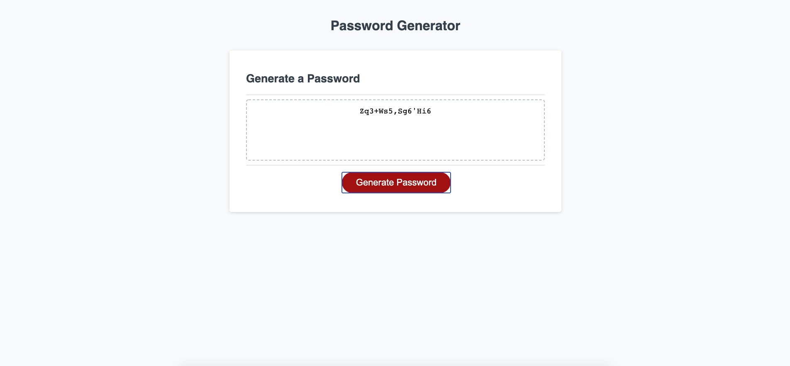

# password-generatorv2

## Description
#### Create random password based on user input

## Tasks
#### Create password criteria
#### Set lenght min / max
#### Option for uppercase / lowercase / special / numeric characters
#### Validate inputs

## Repo Link
(https://lukenorys.github.io/password-generatorv2/)

## Deployed Link (on click) / ScreenShot
